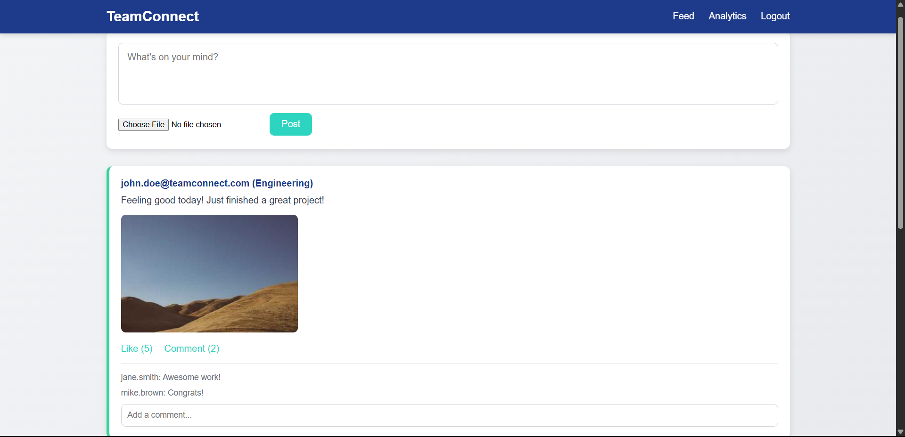
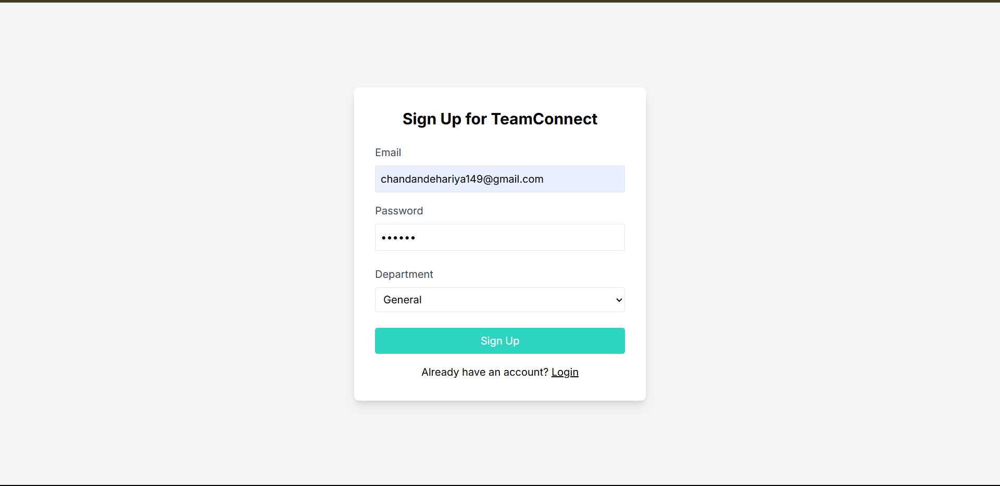
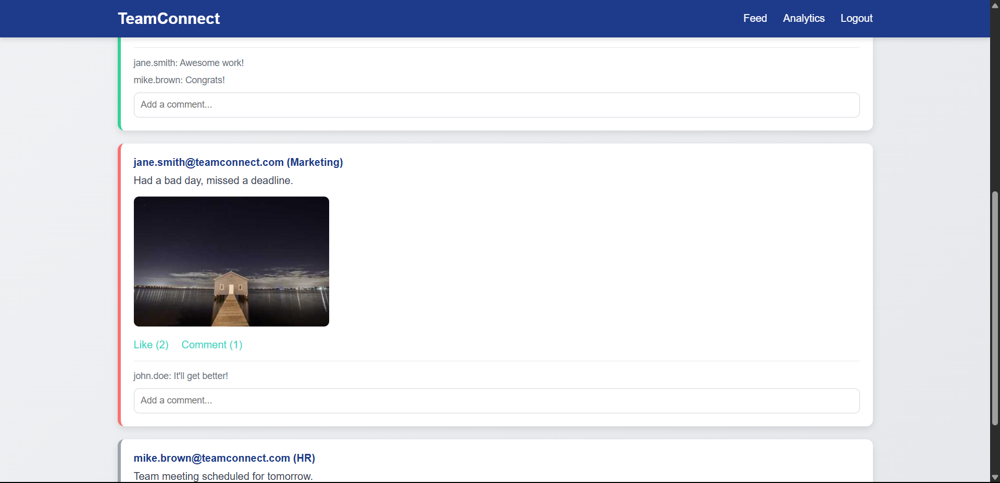
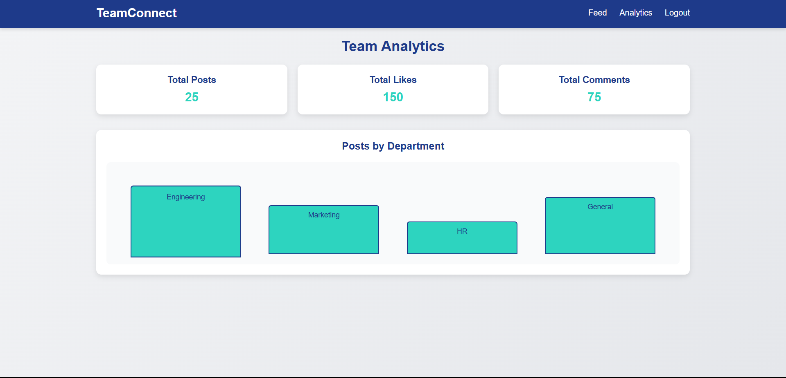

# TeamConnect - Internal Social Media Platform

**TeamConnect** is a full-stack MERN (MongoDB, Express.js, React, Node.js) internal social media platform that allows teams to connect, share updates, and track team engagement. With a modern, responsive design and seamless UX, TeamConnect fosters collaboration within organizations.

---

## 🚀 Features

- **Post Sharing**: Team members can share updates or announcements with optional file attachments.
- **Comments & Likes**: Engage with posts through threaded comments and likes.
- **Analytics Dashboard**: Visual overview of total posts, likes, comments, and department-wise activity.
- **User Authentication**: Secure signup/login with department selection.
- **Responsive UI**: Optimized for mobile and desktop with a sleek, minimalist design.

---

## 🛠 Tech Stack

- **Front-end**: React, Axios, CSS
- **Back-end**: Node.js, Express.js, MongoDB (Mongoose)
- **Tools**: Git, VS Code, MongoDB Atlas or local MongoDB

---

## 📸 Screenshots

| Description            | Screenshot                         |
|------------------------|-------------------------------------|
| Feed Page              |          |
| Sign Up Page           |        |
| Feed Page (Alternate)  |          |
| Analytics Dashboard    |   |


---

## 📦 Prerequisites

- **Node.js** (v20.x or later): [Download](https://nodejs.org/)
- **MongoDB** (local installation or Atlas): [Download](https://www.mongodb.com/)
- **Git**: [Download](https://git-scm.com/)

---

## ⚙️ Setup and Installation

### 1. Clone the Repository

```bash
git clone https://github.com/<your-username>/team-connect.git
cd team-connect
```

---

### 2. Back-end Setup

```bash
cd backend
npm install
```

Create a `.env` file in the backend folder:

```env
PORT=5000
MONGO_URI=mongodb://localhost:27017/teamconnect
JWT_SECRET=your_secret_key
```

Start the server:

```bash
npm start
```

The backend will run on `http://localhost:5000/api`.

---

### 3. Front-end Setup

```bash
cd ../frontend
npm install
npm start
```

The frontend will be available at `http://localhost:3000`.

---

## 🧪 Test the Application

- **Sign Up/Login**: Create an account with email, password, and department.
- **Feed**: View all posts and interact via likes and comments.
- **Add a Post**: Use the post creation form to publish updates.
- **Analytics**: View summary stats on posts, likes, and comments.
- **Database**: MongoDB stores all data (users, posts, etc.) in the `teamconnect` DB.

---

## 📚 Dependencies

### Back-end (`backend/package.json`)
- express
- mongoose
- dotenv
- bcryptjs
- jsonwebtoken
- multer
- cors

### Front-end (`frontend/package.json`)
- react
- axios
- react-router-dom

### External Libraries
- **Poppins Font**: [Google Fonts](https://fonts.googleapis.com/css2?family=Poppins)
- **Icons**: [Icons8](https://icons8.com)

---

## 🔧 Configurations

### Environment Variables (`backend/.env`)

```env
PORT=5000
MONGO_URI=mongodb://localhost:27017/teamconnect
JWT_SECRET=your_secret_key
```

### CORS

Make sure `cors()` middleware is properly configured in Express to allow:

```js
app.use(cors({
  origin: 'http://localhost:3000',
  credentials: true
}));
```

---

## 🛠 Troubleshooting

- **MongoDB Connection Error**:
  - Ensure MongoDB is running locally or check your Atlas URI.

- **Port Conflict**:
  - Change ports in `.env` or `package.json`.

```json
"scripts": {
  "start": "react-scripts start --port 3001"
}
```

- **CORS Issues**:
  - Ensure CORS is enabled in the backend.

- **JWT Errors**:
  - Confirm `JWT_SECRET` is defined in `.env`.

---

## 🧪 Demo

A Single Page MERN Application:

- **MongoDB**: Stores all app data.
- **RESTful APIs**: For authentication, posts, and analytics.
- **React**: Builds the UI with client-side routing and dynamic updates.

---

## 🎓 Project Notes (College Submission)

✅ MongoDB used as the database  
✅ REST API endpoints for users and posts  
✅ Secure Auth system  
✅ Full CRUD operations  
✅ Modern UI with screenshots  
✅ README documentation provided  

---

## 📄 License

MIT License

---

**Developed by Chandan Dehariya**
